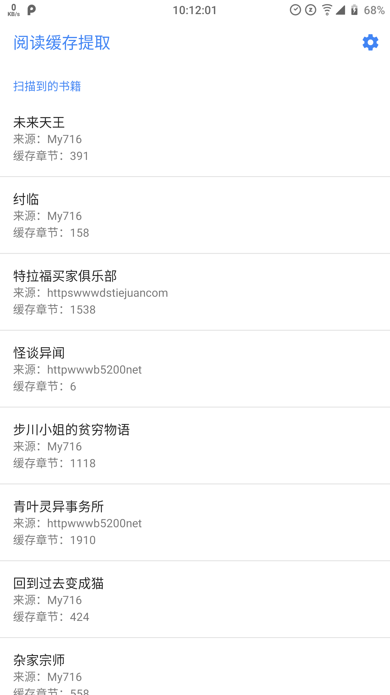
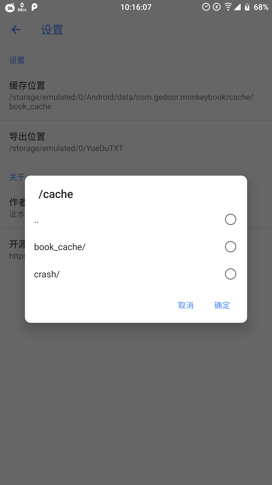

## 「阅读」缓存助手
由于缓存导出为 TXT 并不是必要的需求，故而「阅读」本身并没有很强烈的意愿支持导出功能，为了满足部分用户的需求写了这个小工具。

### 使用方法
启动软件并授予必要权限后，通过扫描「阅读」的缓存目录来分析已缓存的小说，点按即可导出。
- 默认缓存目录为 /内置存储/Android/data/com.gedoor.monkeybook/cache/book_cache/
- 默认导出目录为 /Users/zsakvo/project/hexo-yuedu/hexo-theme-doc-seed/source/index.md/内置存储/Documents/YueDuTXT

### 软件截图

