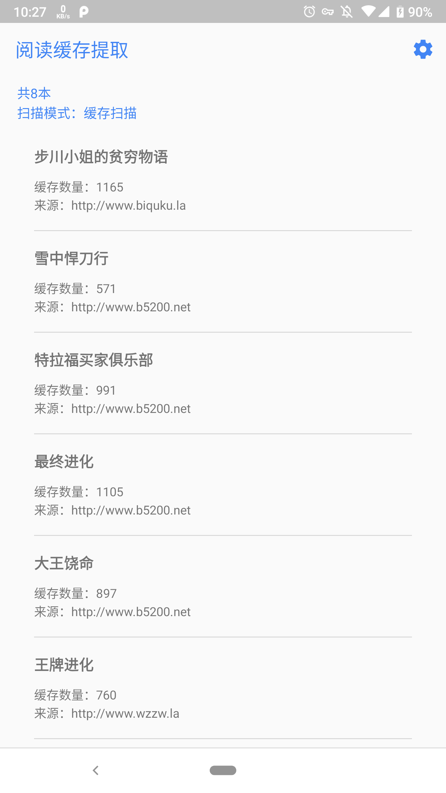
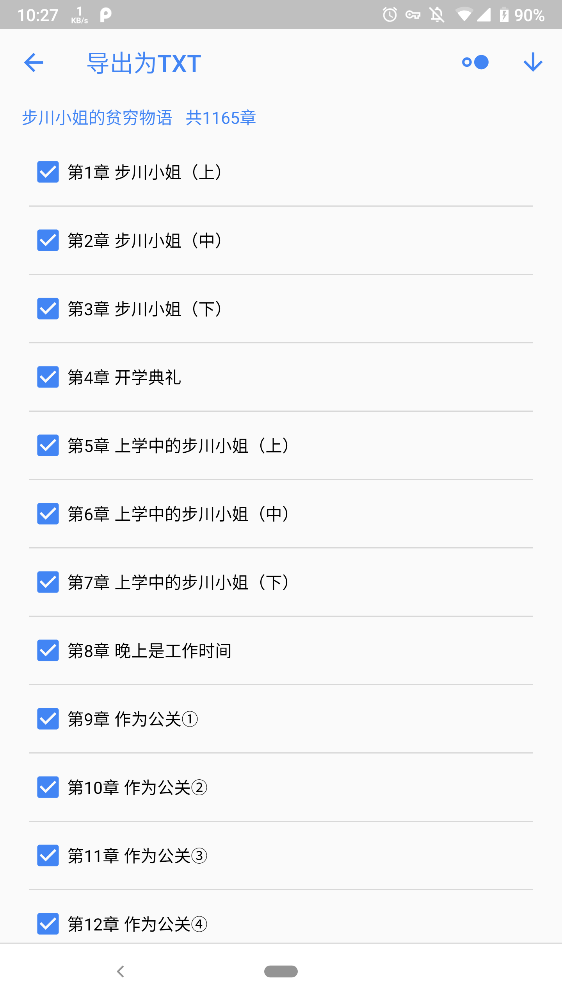
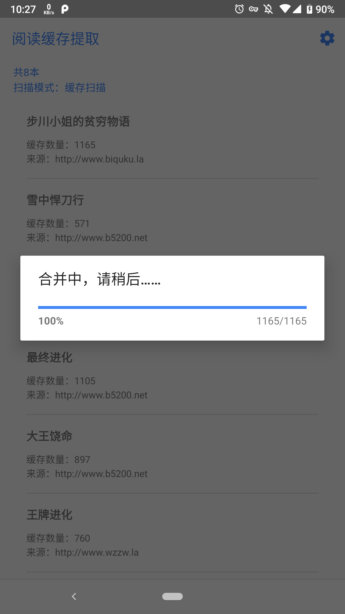
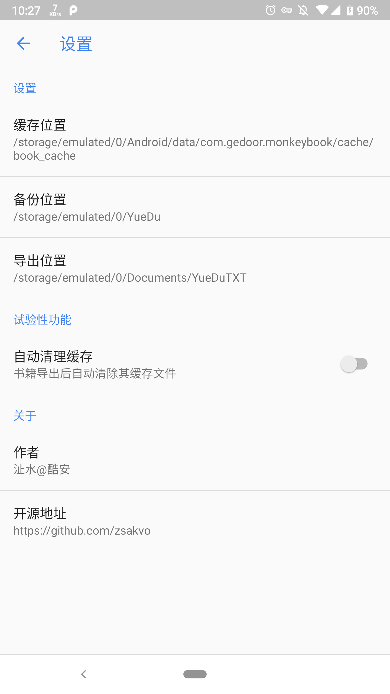

## 「阅读」缓存助手
由于缓存导出为 TXT 并不是必要的需求，故而「阅读」本身并没有很强烈的意愿支持导出功能，为了满足部分用户的需求写了这个小工具。

### 使用方法
启动软件并授予必要权限后，通过扫描「阅读」的缓存目录来分析已缓存的小说，点按选择导出类别，勾选好要导出的章节后即可导出合并后的文件。
- 默认读取的缓存目录为 /内置存储/Android/data/com.gedoor.monkeybook/cache/book_cache/
- 默认读取的备份目录为 /内置存储/Android/YueDu/
- 默认导出目录为 内置存储/Documents/YueDuTXT/

### 详细说明
- 目前扫描书籍有两种模式，一种从「阅读」的备份文件（myBookShel.json）中读取相关信息，另一种为直接扫描「阅读」的缓存目录，自行生成书籍列表。
- 两种模式是自动选择的，选择标准为比较用户的最后操作。举个栗子，如果在打开本软件前，用户最后所做的是缓存了某本书，那么会触发缓存扫描模式。如果用户最后的操作为备份（如果是点按两次返回键退出，仍然视为备份），则触发备份扫描模式。
- 目前来说二者并无过大区别，唯一不同之处在于书籍列表显示的信息不同，不影响导出。

### 关于导出
由于用户在使用「阅读」的过程中，难免会使用换源功能，而此时便会存在多份同一书籍的缓存文件，软件的判断标准如下：
- 在备份扫描模式下，软件会自动选择用户最后切换的源的目录内读取章节缓存
- 在缓存扫描模式下，软件会选择缓存内容最多的源来读取

### 冲突解决
有较小的概率会存在两本书同名的情况，这时如果要准确识别请触发备份扫描（手动去「阅读」内进行一次备份或者正常退出），缓存扫描由于原理限制无法处理这种情况，只会选择缓存内容最多的一本进行导出

### 软件截图

